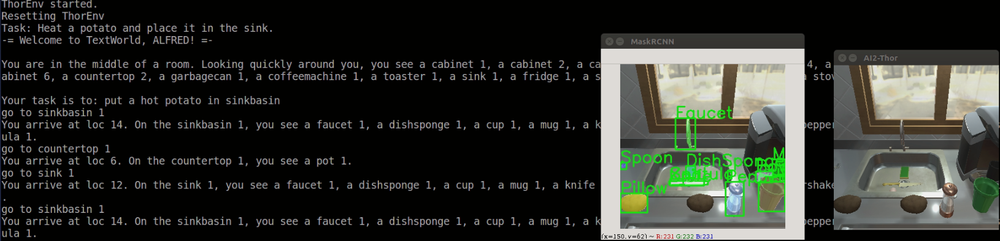

# Play


### TextWorld

Interact with TextWorld games:

```bash
$ alfworld-play-tw $ALFWORLD_DATA/json_2.1.1/train/pick_heat_then_place_in_recep-Potato-None-SinkBasin-14/trial_T20190908_231731_054988/ 
```

Use Tab to auto complete from a list of candidate actions from the text-engine.

```
-= Welcome to TextWorld, ALFRED! =-

You are in the middle of a room. Looking quickly around you, you see a sinkbasin 1,
a stoveburner 3, a cabinet 2, a microwave 1, a fridge 1, a cabinet 1, a cabinet 3,
a cabinet 7, a countertop 2, a cabinet 4, a stoveburner 4, a garbagecan 1, a cabinet 8,
a cabinet 6, a coffeemachine 1, a toaster 1, a countertop 1, a stoveburner 2,
a stoveburner 1, and a cabinet 5.

Your task is to: put a hot potato in sinkbasin.

> go to countertop 1
You arrive at loc 15. On the countertop 1, you see a plate 2, a spatula 3, a ladle 1,
a fork 3, a pan 1, a bread 1, a knife 1, a butterknife 1, a egg 3, a knife 2,
a spatula 2, a tomato 1, and a spatula 1.

> go to countertop 2
You arrive at loc 21. On the countertop 2, you see a saltshaker 1, a mug 2,
a spoon 1, a apple 1, a potato 2, a potato 1, a bowl 3, a cup 2, a fork 2,
a fork 1, and a apple 2.

> take potato 1 from countertop 2
You pick up the potato 1 from the countertop 2.

> go to microwave 1
You arrive at loc 10. The microwave 1 is closed.

> heat potato 1 with microwave 1
You heat the potato 1 using the microwave 1.

> go to sinkbasin 1
You arrive at loc 8. On the sinkbasin 1, you see a knife 3, a egg 2,
and a dishsponge 3.

> put potato 1 in/on sinkbasin 1
You won!
```

**Note**: When loading a TextWorld game, if you see the following error
```
  File "../python3.9/site-packages/textworld/logic/pddl_logic.py", line 123, in <listcomp>
    arguments = [Variable(get_var_name(arg), name2type[arg]) for arg in args if arg]
KeyError: 'val1'
```
it means the game is unsolvable or the PDDL problem is ill-defined. Some tasks from ALFRED like movable receptacle tasks are not used in ALFWorld, and will fail if you try to load them with `alfworld-play-tw`.

### THOR

Interact with embodied games:

```bash
$ alfworld-play-thor $ALFWORLD_DATA/json_2.1.1/train/pick_heat_then_place_in_recep-Potato-None-SinkBasin-14/trial_T20190908_231731_054988/ --controller oracle_astar --debug
```

Use `--agent mrcnn_astar` with `--debug` to inspect the BUTLER controller (MaskRCNN detector & A* Navigator).


